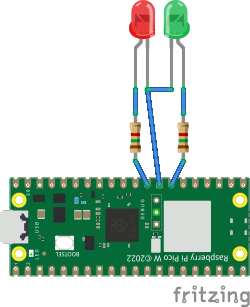
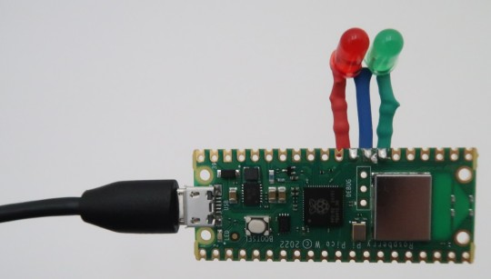

MorningTown: A silent alarm clock
=================================

Description
-----------

MorningTown is a silent alarm clock system for a Raspberry Pi Pico W.

At 7:15am, it lights a single green LED.  At 8am, it additionally lights a red
LED.  Around midday, it turns them both off.  It does literally nothing else.
Oh, apart from synchronising the Pico's real-time clock using NTP.


Why???
------

Awareness of the exact time is bad for your sleep.  If you're having trouble
getting to sleep, knowing how late it is only increases your stress level,
making it even harder to sleep.  Similarly, knowing that your alarm will go off
shortly can prevent you from relaxing in the morning, and grabbing a valuable
few minutes' extra sleep.

All that you really need is an indicator of whether or not it's a sensible time
to get up, or whether you should go back to sleep.  That's all that MorningTown
will give you.

In contrast to a clock radio or "artificial sunrise" lamp, there is no danger
of disturbing any other beings who share the room and may run on different
schedules.

Obviously, you should set an audible alarm clock for important wake-up calls.
But, in combination with regular sleep hygiene, two LEDs might be all you need
to synchronise your sleep pattern!


Hardware
--------

You'll need a Raspberry Pi Pico W.  Solder red and green LEDs to GPIOs 21 and
22 respectively, each with a 1.5 kOhm series resistor (you won't need much
brightness).  There is a ground pad conveniently placed between the two pins.

    

(Hopefully your soldering is a little neater than mine).

You can use other GPIOs if you prefer - just change the definitions of
`LED_RED` and `LED_GREEN` in `morningtown.c`.  The positions of 21 and 22 just
happen to work well for the geometry of my own nightstand.


Software
--------

Edit `compile` to set the path to the [Pico SDK](https://github.com/raspberrypi/pico-sdk),
as well as your WLAN name and password.

Set your offset from UTC in `ntp_client.h`, e.g. if you live in time zone UTC+1:
```
#define UTC_OFFSET_SEC 3600
```
Sorry, there's no automatic handling of daylight savings yet.

To set different wake-up times, edit routine `check_clock()` in
`morningtown.c`.

Run `compile`, then copy `build/morningtown.uf2` to the Pico.


Boot up sequence
----------------

Connect the Pico to any USB power supply.  Afterwards:

1. All three LEDs (red, green and the one on Pi board itself) light for 2
   seconds, then switch off.
2. Board LED lights to indicate WLAN connection
3. Flashing red LED indicates a problem.  It will try again shortly.
4. Alternating red and green LEDs indicate successful NTP synchronisation.
5. All LEDs turn off.  Everything dark until morning.


Licence
-------

MorningTown is based on a heavily modified version of one of the Pico SDK
examples (picow-ntp-client), copyright (c) 2022 Raspberry Pi (Trading) Ltd.,
under the BSD 3-clause licence.

MorningTown is free software: you can redistribute it and/or modify it under the
terms of the GNU General Public License as published by the Free Software
Foundation, either version 3 of the License, or (at your option) any later
version.

MorningTown is distributed in the hope that it will be useful, but WITHOUT ANY
WARRANTY; without even the implied warranty of MERCHANTABILITY or FITNESS FOR A
PARTICULAR PURPOSE.  See the GNU General Public License for more details.

You should have received a copy of the GNU General Public License along with
MorningTown.  If not, see <http://www.gnu.org/licenses/>.


About the name
--------------

It's like a railway signal for your sleep:

> Somewhere there is sunshine  
> Somewhere there is day  
> Somewhere there is Morning town  
> Many miles away

- [The Seekers, 1966](https://www.youtube.com/watch?v=lsqNcZ1JqW8)
