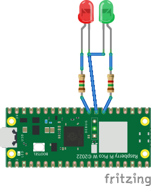
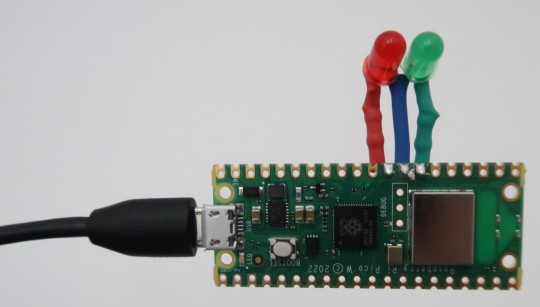

MorningTown: A silent alarm clock
=================================

Description
-----------

MorningTown is a silent alarm clock system based on a Raspberry Pi Pico.

At 7:15am, it lights a single green LED.  At 8am, it additionally lights a red
LED.  Around midday, it turns them both off.  Apart from an over-engineered
configuration system, it does literally nothing else.

Why???
------

You are supposed to get out of bed if you wake up and see the green light, or
perhaps doze until you see the red light as well.  If no lights are on, go
back to sleep.

Huh??
-----

[Awareness of the exact time is bad for your sleep](https://www.techradar.com/health-fitness/mattresses/clock-watching-could-be-killing-your-sleep-why-clocks-have-no-place-in-the-bedroom).

If you're having trouble getting to sleep, seeing the time will add stress
and make it even harder to sleep.  Similarly, knowing that your alarm will go off
shortly can prevent you from relaxing in the morning, and grabbing a valuable
few minutes' extra sleep.

MorningTown reduces information about the time down to a simple signal to say
either "Go back to sleep" or "Get up if you're ready".

In contrast to a clock radio or "artificial sunrise" lamp, there is no danger
of disturbing any other beings who share the room and may run on different
schedules.

I still have a number of questions
----------------------------------

Obviously, you should set an audible alarm clock for important wake-up calls.

Hardware
--------

The Pi Pico's real-time clock loses time when power is removed, so MorningTown
needs either a separate battery-backed RTC module, or to synchronise itself
using NTP on each startup.

### PCB with real-time clock and battery backup

Send the circuit board design in the `pcb` folder
([KiCad](https://www.kicad.org/) format) to your manufacturer of choice.
I have been using [Aisler](https://aisler.net/).

### Cheap and cheerful option

Solder red and green LEDs to GPIOs 22 and 21 respectively of a Raspberry Pi
Pico W, each with a 1.5 kOhm series resistor (you won't need much brightness).
There is a ground pad conveniently placed between these two pins.

    

You can use other GPIOs if you prefer - see below for configuration
instructions.

Firmware
--------

Edit `compile` to set the path to the [Pico SDK](https://github.com/raspberrypi/pico-sdk),
as well as your WLAN name and password if you are using a Pico W.

The changeover days for daylight savings are hard-coded for Europe (the last
Sundays of March and October).  Unfortunately, a full local time library is far
too big to fit on the Pico, so you will have to figure out the logic yourself
for other time zones.

Run `compile`, then copy `build/morningtown.uf2` to the Pico.

Operation
---------

Connect the Pico to any USB power supply.

When the (optional) test button is held, the LEDs indicate as follows:
* Red: NTP synchronised if applicable, otherwise always on.
* Green: RTC time OK (regardless of source).
* Board LED: WLAN connected if applicable, otherwise always on.

Licence
-------

MorningTown is based on a heavily modified version of one of the Pico SDK
examples (picow-ntp-client), copyright (c) 2022 Raspberry Pi (Trading) Ltd.,
under the BSD 3-clause licence.

MorningTown is free software: you can redistribute it and/or modify it under the
terms of the GNU General Public License as published by the Free Software
Foundation, either version 3 of the License, or (at your option) any later
version.

MorningTown is distributed in the hope that it will be useful, but WITHOUT ANY
WARRANTY; without even the implied warranty of MERCHANTABILITY or FITNESS FOR A
PARTICULAR PURPOSE.  See the GNU General Public License for more details.

You should have received a copy of the GNU General Public License along with
MorningTown.  If not, see <http://www.gnu.org/licenses/>.

About the name
--------------

It's like a railway signal for your sleep:

> Somewhere there is sunshine  
> Somewhere there is day  
> Somewhere there is Morning town  
> Many miles away

- [Malvina Reynolds](https://en.wikipedia.org/wiki/Morningtown_Ride)
